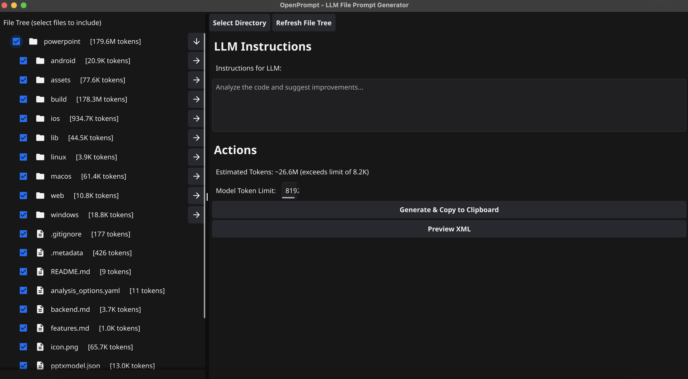
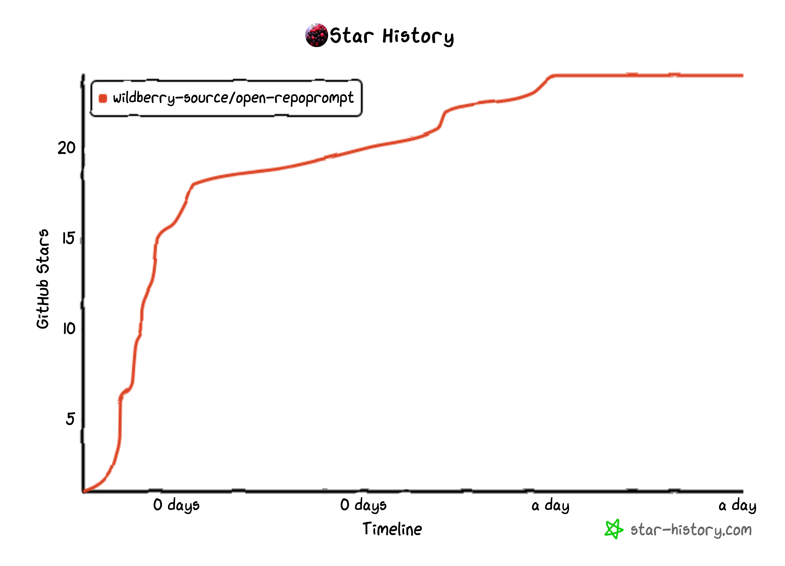

# OpenPrompt


# COPY ENTIRE FOLDER AND FILES as context INSIDE LLM OF YOUR CHOICE



o1 PRO , GROK 3 thinking are one of the best model available right now, but there is api access available.
This Tool Simplifies the process of copying files and folders into LLMs.

Fastest Serialization of files and folders into XML format.

## Installation

### Download Executable (Recommended)

1. Go to the [Releases page](https://github.com/wildberry-source/open-repoprompt/releases)
2. Download the appropriate version for your operating system:
   - Windows: `openprompt-windows-amd64.exe`
   - macOS: `openprompt-macos-amd64`
   - macOS arm: `openprompt-macos-arm64`
   - Linux: `openprompt-linux-amd64`


### Building from Source

```bash
# Clone the repository
git clone https://github.com/wildberry-source/open-repoprompt.git

# Navigate to the project directory
cd open-repoprompt

# Build the application
go build -o openprompt ./cmd
```

## How to Use

1. **Select Directory**: Choose a directory containing your code
2. **Set Filters**: Specify which files to include/exclude
3. **Select Files**: Check the boxes next to files you want
4. **Add Instructions**: Tell the LLM what you need
5. **Generate & Copy**: Create your XML prompt and copy to clipboard
6. **Paste into LLM**: Use with Claude, GPT-4, Grok, or any LLM that accepts XML

## Use Cases

- **Code Reviews**: Feed your entire codebase for comprehensive reviews
- **Documentation Generation**: Create docs for your project based on source code
- **Refactoring Help**: Get suggestions for improving complex code
- **Bug Hunting**: Let LLMs analyze your code to find potential issues
- **Learning New Codebases**: Quickly understand unfamiliar projects
- **Architecture Analysis**: Get insights on your project structure

## XML Prompt Format

```xml
<prompt>
  <files>
    <file path="project/main.go" type="go">package main

func main() {
    println("Hello")
}
</file>
    <file path="project/utils/helper.go" type="go">...</file>
  </files>
  <instructions>Analyze the code and suggest improvements.</instructions>
</prompt>
```

## Stars





## License

MIT
